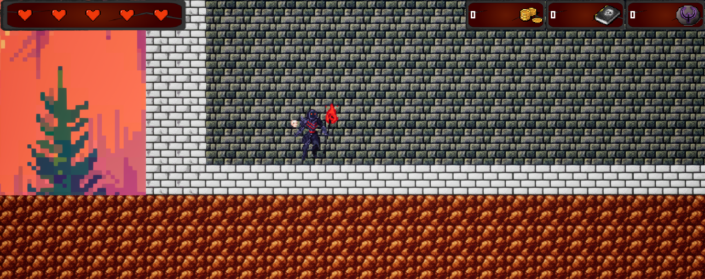

# 🎮 OBJECTIF3D-UNREAL-PORTAGE – Scroll of the Undead

[](#license)
[](https://github.com/Lurius-Kitsune/OBJECTIF3D-UNREAL-PORTAGE-Scroll-of-the-Undead/actions)
[](https://github.com/Lurius-Kitsune/OBJECTIF3D-UNREAL-PORTAGE-Scroll-of-the-Undead)
[](https://github.com/Lurius-Kitsune/OBJECTIF3D-UNREAL-PORTAGE-Scroll-of-the-Undead/commits)

---

## 📖 Overview

**OBJECTIF3D-UNREAL-PORTAGE – Scroll of the Undead** is a **port of the original _Simple-SFML-2D-Game_** into **Unreal Engine**, aiming to preserve its original gameplay logic, structure, and architecture while enhancing it through Unreal’s modern 3D, rendering, and toolset capabilities.

🔧 **Project constraint:**  
This Unreal port strictly follows the **original SFML project architecture** — including its class structure, logic separation, and update/draw patterns — to ensure a faithful translation from 2D SFML to Unreal’s component-based system.

Original repository: [mataktelis/Simple-SFML-2D-Game](https://github.com/mataktelis/Simple-SFML-2D-Game)

---

## 🧩 Features

- Full **port of SFML architecture** into Unreal Engine  
- Game loop, state management, and rendering pipeline reimplemented using Unreal conventions  
- Hybrid **2D/3D** rendering for sprites and gameplay systems  
- **Strict respect of the original architecture**, including separation of logic and rendering layers  
- Asset loading, player movement, enemies, collisions, and score system  
- Modular Unreal classes for scalability and maintainability  
- Example levels and animation blueprints included  

---

## 🛠️ Requirements & Dependencies

- **Unreal Engine version:** 5.6 
- **Supported platforms:** Windows  
- **Development tools:** Visual Studio 2022 
- **Optional plugins or assets:** PaperZD for sprite Animation 

---

## 🚀 Getting Started

### 🎯 Clone the Repository

```bash
git clone https://github.com/Lurius-Kitsune/OBJECTIF3D-UNREAL-PORTAGE-Scroll-of-the-Undead.git
cd OBJECTIF3D-UNREAL-PORTAGE-Scroll-of-the-Undead
```

### 🧱 Setup & Project Generation

1. Generate project files:
   ```bash
   UnrealBuildTool -projectfiles
   ```
   or through Unreal Editor: **File → Generate Visual Studio project files**
2. Open the `.uproject` file in Unreal Engine or your IDE
3. Build the project
4. Run it in the Unreal Editor (Play button) or as a packaged build

### 🎮 Controls

| Action | Key |
|--------|-----|
| Move   | WASD / Arrow keys |
| Attack | Spacebar |
| Quit   | Esc |

*(You can customize these in the input mapping context in the project.)*

---

## 📂 Project Structure

```
/Config
/Content
/DataSource
/Source
RevisionP2.uproject
.gitignore
.gitattributes
```

**Folders overview:**

- **Config:** Unreal and project configuration files  
- **Content:** Game assets (textures, sounds, animations, maps)  
- **DataSource:** Data-driven assets or references to SFML resources  
- **Source:** Core Unreal C++ source code, following SFML’s architecture pattern  
- **RevisionP2.uproject:** Unreal project file  

---

## 🧪 Testing & Validation

- Manual playtesting for gameplay accuracy vs. the SFML original  
- Comparison of class flow and logic to ensure 1:1 mapping  
- Unreal Profiler for frame rate and memory performance  

---

## 📈 Roadmap / Future Work

I might do some test while I'm still learning in school.

---

## 🤝 Contributing
No need for contribution.

---

## 📜 License

This project is licensed under the **MIT License**.  
See the [LICENSE](LICENSE) file for full details.

---

## 🧾 Credits & Acknowledgments

- Original project: *Simple-SFML-2D-Game* by **mataktelis**  
- Unreal port: **Lurius-Kitsune**  
- Academic context: **Objectif3D Unreal Portage project**  
- Assets: Various free and open assets (see `/Content` for details)

---

## 📬 Contact

For inquiries, feedback, or bug reports:  
- GitHub Issues    

---

## 🎨 Screenshots / Media



---

Thank you for checking out **Scroll of the Undead** —  
A faithful Unreal Engine port built with fun ⚔️
